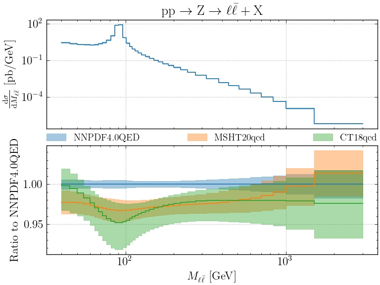

  

  
  
  
  
  

# What is PineAPPL?

This repository contains programs, libraries and interfaces to read and write
`PineAPPL` interpolation grids, which store theoretical predictions for
[high-energy collisions] independently from their [PDFs] and the [strong
coupling].

PineAPPL grids are generated by Monte Carlo generators, and the grids in turn
can be convolved with PDFs to produce tables and plots, such as the following
one:

(image from [arXiv:2401.08749], on p. 16, figure 4.4)

[high-energy collisions]: https://en.wikipedia.org/wiki/Particle_physics
[PDFs]: https://en.wikipedia.org/wiki/Parton_(particle_physics)#Parton_distribution_functions
[strong coupling]: https://en.wikipedia.org/wiki/Coupling_constant#QCD_and_asymptotic_freedom
[arXiv:2401.08749]: https://arxiv.org/abs/2401.08749

# Quick links

- [Documentation](docs/README.md)
- [Installation instructions](docs/installation.md)
- [Changelog](CHANGELOG.md)

# Tools using PineAPPL

Below are some samples of tools in high-energy physics that uses PineAPPL.

<table>
  <thead>
    <tr>
      <th>Tool</th>
      <th>Description</th>
    </tr>
  </thead>
  <tbody>
    <tr><th colspan="2">Parton-Level Monte Carlo Generators</th></tr>
    <tr>
      <td><a href="https://nnlojet.hepforge.org/index.html"><b>NNLOJet</b></a></td>
      <td>Parton-level event generator for jet cross sections at NNLO QCD accuracy.</td>
    </tr>
    <tr>
      <td><a href="https://matrix.hepforge.org/"><b>MATRIX</b></a></td>
      <td>Parton-level event generator for fully differential cross sections at NNLO.</td>
    </tr>
    <tr><th colspan="2">General-Purpose Monte Carlo Generators</th></tr>
    <tr>
      <td><a href="https://github.com/mg5amcnlo/mg5amcnlo"><b>MadGraph5_aMC@NLO</b></a></td>
      <td>Multi-purpose event generator for LO and NLO calculations.</td>
    </tr>
    <tr><th colspan="2">Fixed-order Codes</th></tr>
    <tr>
      <td><a href="https://github.com/QCDLab/PineAPFEL"><b>PineAPFEL</b></a></td>
      <td>APFEL++ interface that produces PineAPPL grids with coefficient functions for unpolarized and longitudinally polarized DIS, SIA, and SIDIS.</td>
    </tr>
    <tr>
      <td><a href="https://github.com/NNPDF/yadism"><b>Yadism</b></a></td>
      <td>Computes DIS coefficient functions up to N3LO for unpolarized and longitudinally polarized processes.</td>
    </tr>
    <tr><th colspan="2">Evolution Codes</th></tr>
    <tr>
      <td><a href="https://github.com/QCDLab/PineAPFEL"><b>PineAPFEL</b></a></td>
      <td>Evolves theory predictions stored as PineAPPL grids using APFEL++.</td>
    </tr>
    <tr>
      <td><a href="https://github.com/NNPDF/pineko"><b>Pineko</b></a></td>
      <td>Evolves theory predictions stored as PineAPPL grids using EKO evolution operators.</td>
    </tr>
    <tr><th colspan="2">PDF Fitting Codes</th></tr>
    <tr>
      <td><a href="https://ncteq.hepforge.org/"><b>nCTEQ</b></a></td>
      <td>Framework for extracting nuclear parton distribution functions.</td>
    </tr>
    <tr>
      <td><a href="https://github.com/NNPDF/nnpdf"><b>NNPDF</b></a></td>
      <td>Machine learning framework for global PDF analyses.</td>
    </tr>
    <tr>
      <td><a href="https://gitlab.cern.ch/fitters/xfitter"><b>xFitter</b></a></td>
      <td>QCD fit framework designed to extract PDFs.</td>
    </tr>
    <tr><th colspan="2">Interfaces to Other Grid Formats</th></tr>
    <tr>
      <td><a href="https://applgrid.hepforge.org/"><b>APPLgrid</b></a></td>
      <td>Fast interpolation grid library for PDF-independent storage of perturbative QCD calculations.</td>
    </tr>
    <tr>
      <td><a href="https://fastnlo.hepforge.org/"><b>fastNLO</b></a></td>
      <td>Framework for fast pQCD calculations for hadron-induced processes.</td>
    </tr>
  </tbody>
</table>

# Citation

If you use PineAPPL, please cite

1. the software itself using its [zenodo DOI] and
2. the [paper] introducing it.

By using PineAPPL, you're probably also using

- [APPLgrid],
- [fastNLO] and/or
- [LHAPDF].

If that is the case, please cite these accordingly.

[APPLgrid]: https://applgrid.hepforge.org
[fastNLO]: https://fastnlo.hepforge.org
[LHAPDF]: https://lhapdf.hepforge.org
[zenodo DOI]: https://zenodo.org/badge/latestdoi/248306479
[paper]: https://inspirehep.net/literature/1814432
