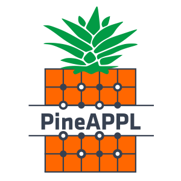

  

  
  
  
  
  

# What is PineAPPL?

This repository contains programs, libraries and interfaces to read and write
`PineAPPL` interpolation grids, which store theoretical predictions for
[high-energy collisions] independently from their [PDFs] and the [strong
coupling].

PineAPPL grids are generated by Monte Carlo generators, and the grids in turn
can be convolved with PDFs to produce tables and plots, such as the following
one:

(image from [arXiv:2401.08749], on p. 16, figure 4.4)

[high-energy collisions]: https://en.wikipedia.org/wiki/Particle_physics
[PDFs]: https://en.wikipedia.org/wiki/Parton_(particle_physics)#Parton_distribution_functions
[strong coupling]: https://en.wikipedia.org/wiki/Coupling_constant#QCD_and_asymptotic_freedom
[arXiv:2401.08749]: https://arxiv.org/abs/2401.08749

# Quick links

- [Documentation](docs/README.md)
- [Installation instructions](docs/installation.md)
- [Changelog](CHANGELOG.md)

# Citation

If you use PineAPPL, please cite

1. the software itself using its [zenodo DOI] and
2. the [paper] introducing it.

By using PineAPPL, you're probably also using

- [APPLgrid],
- [fastNLO] and/or
- [LHAPDF].

If that is the case, please cite these accordingly.

[APPLgrid]: https://applgrid.hepforge.org
[fastNLO]: https://fastnlo.hepforge.org
[LHAPDF]: https://lhapdf.hepforge.org
[zenodo DOI]: https://zenodo.org/badge/latestdoi/248306479
[paper]: https://inspirehep.net/literature/1814432
