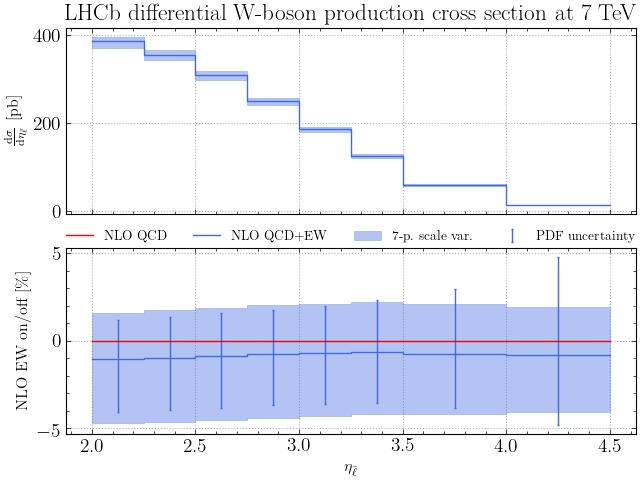
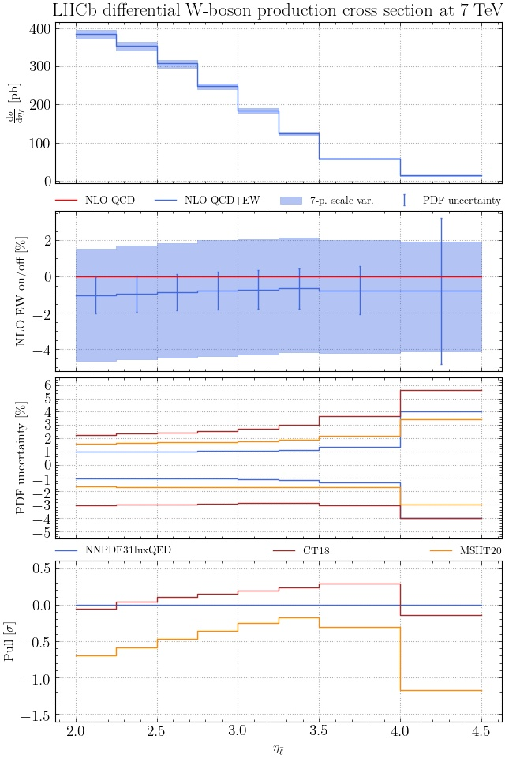

# Tutorial for PineAPPL's CLI

Welcome to PineAPPL's CLI tutorial! Here we'll explain the basics of PineAPPL's
command-line interface (CLI): that's the program `pineappl` that you can you use
inside your shell to convolute grids with PDFs and perform other operations.
This tutorial will also introduce and explain the terminology needed to
understand the C, Fortran, Python and Rust API.

This tutorial assumes that understand the basics of interpolation grids. If
you'd like to refresh your memory read the short
[overview](interpolation-grids.md).

## Prerequisites

To take the tutorial, you'll need PineAPPL's CLI; follow the installation
section in the [README](../README.md). Next, you'll need a fresh directory. For
instance, running

    cd $(mktemp -d)

will create a temporary directory. Finally, you'll need a grid,

    wget 'https://github.com/N3PDF/pineappl/raw/master/pineappl_cli/data/LHCB_WP_7TEV.pineappl.lz4'

which will be used together with the CLI.

## `pineappl convolute`: Performing convolutions

Now that we've got a grid, we can perform a convolution with a PDF set:

    pineappl convolute LHCB_WP_7TEV.pineappl.lz4 CT18NNLO

We've chosen to use the default CT18 PDF set for this tutorial, because it's
the shortest to type. If you get an error that reads

    error: Invalid value for '<PDFSETS>...': The PDF set `CT18NNLO` was not found

install the PDF set with LHAPDF, or use a different PDF set—the numbers won't
matter for the sake of the tutorial. If the command was successful, you should
see the following output:

    LHAPDF 6.4.1a loading /home/cschwan/prefix/share/LHAPDF/CT18NNLO/CT18NNLO_0000.dat
    CT18NNLO PDF set, member #0, version 1; LHAPDF ID = 14000
    b   etal    disg/detal  scale uncertainty
         []        [pb]            [%]
    -+----+----+-----------+--------+--------
    0    2 2.25 3.8562616e2    -3.69     2.65
    1 2.25  2.5 3.5553189e2    -3.70     2.73
    2  2.5 2.75 3.0928086e2    -3.68     2.79
    3 2.75    3 2.4991572e2    -3.66     2.83
    4    3 3.25 1.8610527e2    -3.62     2.85
    5 3.25  3.5 1.2614289e2    -3.57     2.87
    6  3.5    4 5.9206239e1    -3.47     2.84
    7    4  4.5 1.3881523e1    -3.29     2.75
    Thanks for using LHAPDF 6.4.1a. Please make sure to cite the paper:
      Eur.Phys.J. C75 (2015) 3, 132  (http://arxiv.org/abs/1412.7420)

On your computer the output will be slightly different depending on your LHAPDF
installation. If you don't want to see LHAPDF messages, add the option
`--silence-lhapdf` after `pineappl` and before `convolute`:

    pineappl --silence-lhapdf convolute LHCB_WP_7TEV.pineappl.lz4 CT18NNLO

Let's have a closer look at what the output shows:

- the `b` column shows there are 8 bins, labeled `0` to `7`,
- the next two columns labelled `etal` shows the observable used to define the
  bins and its left and right bin limits,
- `disg/detal` has a spelling mistake, unfortunately, and should read
  `dsig/detal`. It shows the differential cross section (`dsig`) for the bin
  limits given in the previous two columns. Finally,
- the last two columns show the scale uncertainty, which typically is
  asymmetric.

## `pineappl --help`: Getting help

One of the most difficult aspects of learning a new program is remembering how
to achieve certain tasks and what to type. This should be easy with `pineappl`.
If you don't want to remember a bunch of commands just remember that you can
type

    pineappl

which is a shortcut for `pineappl --help`. This will give you a list of program
options and *subcommands*, under which all operations in `pineappl` are
grouped, and a corresponding description. You'll be familiar with the concept
of subcommand if you're using `git`: `add`, `commit` and `push` are well-known
subcommands of it.

To get more help on a specific subcommand, for instance `convolute`, which
we've used already, run

    pineappl convolute --help

Depending on the version of PineAPPL this will show output similar to the
following:

    pineappl-convolute
    Convolutes a PineAPPL grid with a PDF set

    USAGE:
        pineappl convolute [OPTIONS] <INPUT> <PDFSETS>...

    ARGS:
        <INPUT>         Path of the input grid
        <PDFSETS>...    LHAPDF id(s) or name of the PDF set(s)

    OPTIONS:
        -a, --absolute              Show absolute numbers of the scale variation
        -b, --bins <BINS>...        Selects a subset of bins
            --digits-abs <ABS>      Set the number of fractional digits shown for absolute numbers
                                    [default: 7]
            --digits-rel <REL>      Set the number of fractional digits shown for relative numbers
                                    [default: 2]
        -h, --help                  Print help information
        -i, --integrated            Show integrated numbers (without bin widths) instead of differential
                                    ones
        -o, --orders <ORDERS>...    Select orders manually
        -s, --scales <SCALES>       Set the number of scale variations [default: 7] [possible values: 1,
                                    3, 7, 9]

If you read the help message carefully, you'll notice for instance that the
scale uncertainty shown previously is a 7-point variation, because the default
value of `--scales` is `7`.

## `pineappl info`: What does this grid contain?

If you're experienced, you've already inferred from the file name of the grid
and the observable name what the convoluted numbers will most likely show.
However, how can we be certain? Specifically, we'll probably want to know the
answers to the following questions:

1. For which process is the prediction for?
2. Which observable is shown?
3. If there's a corresponding experimental paper, where is it?
4. Where are the measured values corresponding to the shown predictions?
5. Which program/generator was used to produce this grid? What version?
6. Which runcards were used, which parameter values?

The subcommand that'll answer all these questions is `info`. This will get you
access to what we call *metadata* (the data describing the interpolation
grids):

    pineappl info --show LHCB_WP_7TEV.pineappl.lz4

This will print out a very long list of (alphabetically sorted) key–value
pairs, from which you can read off the answers to the questions above. Let's go
through them one by one:

1. The value for the key `description` gives a short description of the
   process. In this case this is `LHCb differential W-boson production cross
   section at 7 TeV`.
2. The keys `x1_label` contains the name of the observable, and `y_label` the
   name of the corresponding (differential) cross section. These strings are
   being used by `convolute` and other subcommands that perform convolutions to
   label the columns with the corresponding numbers. If grids contain two- or
   even higher-dimensional distributions there would be additional labels, for
   instance `x2_label`, etc. Furthermore, for plots there are the corresponding
   labels in LaTeX: `x1_label_tex`, `y_label_tex` and so on. Finally, `x1_unit`
   contains the physical units for each observable, typically `GeV`, and
   `y_unit` the units of the (differential) cross section, typically in `pb`.
3. The value of the key `arxiv` gives us the corresponding arXiv identifier, in
   this case for the experimental measurement; enter the value into the search
   field of <https://arxiv.org>, and it'll lead you to the paper.
4. The measured data itself you can get from the location specified by `hepdata`,
   which is a digital object identifier (DOI). Go to <https://www.doi.org/> and
   enter the string there. This will get you to the right table on
   <https://www.hepdata.net> for the corresponding observable. Together with
   the paper this will make clear that the predictions show the pseudorapidity
   of the positively-charged lepton, corresponding to table 6 in the paper.
5. The presence of `mg5amc_repo` and `mg5amc_revno` show that
   [Madgraph5_aMC@NLO] was used to calculate the predictions. Since their
   values are empty, an official release was used, whose version we can read
   off from `runcard`. If these values were non-zero, they'd point to the
   Madgraph5 repository and its revision number.
6. Finally, the value of `runcard` contains runcards of the calculation and
   also the information that Madgraph5_aMC@NLO v3.1.0 was used run the
   calculation, the values of all independent parameters and a few cuts.

If you'd like a complete description of all recognized metadata, have a look at
the [full list](metadata.md).

## `pineappl obl`: Orders, bins and lumis

Each *grid* is—basically—a three-dimensional array of *subgrids*, which are the
actual interpolation grids. The three dimensions are:

- orders (`o`),
- bins (`b`) and
- luminosities/lumis (`l`),

which we abbreviate as `obl`. You can use the subcommand with the same name to
see exactly how each grid is built. Let's go through them one by one using our
grid:

    pineappl obl --orders LHCB_WP_7TEV.pineappl.lz4

The output is:

    o      order
    -+----------------
    0 O(a^2)
    1 O(as^1 a^2)
    2 O(as^1 a^2 lr^1)
    3 O(as^1 a^2 lf^1)
    4 O(a^3)
    5 O(a^3 lr^1)
    6 O(a^3 lf^1)

This shows that there's

- a leading order (LO) with index `0`, which has the coupling alpha squared
  (`a^2`),
- the QCD next-to-leading order (NLO) with index `1` and
- the EW NLO with index `4`.

Additionally, there are

- NLO grids with factorization-log dependent terms, with indices `3` and `6`,
  which are needed for the correct calculation of the scale variation. The
  corresponding
- renormalization-logs (`2` and `5`) are also present, but their contributions
  are in fact zero.

These last two subgrid types are needed if during the convolution the
scale-variation uncertainty should be calculated.

Now let's look at the bins:

    pineappl obl --bins LHCB_WP_7TEV.pineappl.lz4

which prints:

    b   etal    norm
    -+----+----+----
    0    2 2.25 0.25
    1 2.25  2.5 0.25
    2  2.5 2.75 0.25
    3 2.75    3 0.25
    4    3 3.25 0.25
    5 3.25  3.5 0.25
    6  3.5    4  0.5
    7    4  4.5  0.5

this shows the bin indices `b` for the observable `etal`, with their left and
right bin limits, which you've already seen in `convolute`. The column `norm`
shows the factor that all convolutions are divided with. Typically, as shown in
this case, this is the bin width, but in general this can be different.

Finally, let's have a look at the luminosities or *lumis*:

    pineappl obl --lumis LHCB_WP_7TEV.pineappl.lz4

This prints all partonic initial states that contribute to this process:

    l    entry        entry
    -+------------+------------
    0 1 × ( 2, -1) 1 × ( 4, -3)
    1 1 × ( 0, -3) 1 × ( 0, -1)
    2 1 × (22, -3) 1 × (22, -1)
    3 1 × ( 2,  0) 1 × ( 4,  0)
    4 1 × ( 2, 22) 1 × ( 4, 22)

In this case you see that the up–anti-down (2, -1) and charm–anti-strange (4,
-3) initial states (the numbers are PDG MC IDs) are grouped together in a
single *channel*, each with a factor of `1`. In general this number can be
different from one, if the Monte Carlo decides to factor out CKM values or
electric charges, for instance, to group more lumis with the same matrix
elements together. This is an optimization step, as fewer lumis result in a
smaller grid file.

Note that lumis with the transposed initial states, for instance
anti-down—up, are merged with each other, which always works if the two
initial-state hadrons are the same; this is an optimization step, also to keep
the size of the grid files small.

All remaining lumis are the ones with a gluon (in this case denoted with
`0`) or with a photon, `22`.

## `pineappl orders`: What's the size of each perturbative order?

In the previous section you've seen that each order is stored separately, which
means you can convolute each order separately:

    pineappl orders LHCB_WP_7TEV.pineappl.lz4 CT18NNLO

which prints

    b   etal    disg/detal  O(as^0 a^2) O(as^1 a^2) O(as^0 a^3)
         []        [pb]         [%]         [%]         [%]
    -+----+----+-----------+-----------+-----------+-----------
    0    2 2.25 3.8562616e2      100.00       17.21       -1.23
    1 2.25  2.5 3.5553189e2      100.00       17.67       -1.13
    2  2.5 2.75 3.0928086e2      100.00       18.15       -1.03
    3 2.75    3 2.4991572e2      100.00       18.54       -0.91
    4    3 3.25 1.8610527e2      100.00       19.17       -0.85
    5 3.25  3.5 1.2614289e2      100.00       20.00       -0.78
    6  3.5    4 5.9206239e1      100.00       21.34       -0.90
    7    4  4.5 1.3881523e1      100.00       24.77       -1.02

By default all higher orders are shown relative to the sum of all LOs. However,
this can be changed using the switches `--normalize` or `-n`, which asks for
the orders you declare as 100 per cent. If we'd like the numbers to be
normalized to NLO QCD, we'd run

    pineappl orders --normalize=a2,a2as1 LHCB_WP_7TEV.pineappl.lz4 CT18NNLO

which will show

    b   etal    disg/detal  O(as^0 a^2) O(as^1 a^2) O(as^0 a^3)
         []        [pb]         [%]         [%]         [%]
    -+----+----+-----------+-----------+-----------+-----------
    0    2 2.25 3.8562616e2       85.32       14.68       -1.05
    1 2.25  2.5 3.5553189e2       84.98       15.02       -0.96
    2  2.5 2.75 3.0928086e2       84.64       15.36       -0.87
    3 2.75    3 2.4991572e2       84.36       15.64       -0.76
    4    3 3.25 1.8610527e2       83.91       16.09       -0.72
    5 3.25  3.5 1.2614289e2       83.33       16.67       -0.65
    6  3.5    4 5.9206239e1       82.41       17.59       -0.75
    7    4  4.5 1.3881523e1       80.14       19.86       -0.82

## `pineappl channels`: What's the size of each channel?

You can also show a convolution separately for each lumi, or in other words
show the size of each partonic channel:

    pineappl channels LHCB_WP_7TEV.pineappl.lz4 CT18NNLO

This will show the following table,

    b   etal    l  size  l  size  l size  l size l size
         []        [%]      [%]      [%]    [%]    [%]
    -+----+----+-+------+-+------+-+-----+-+----+-+----
    0    2 2.25 0 111.09 3  -7.96 1 -3.13 2 0.00 4 0.00
    1 2.25  2.5 0 111.83 3  -8.68 1 -3.15 2 0.00 4 0.00
    2  2.5 2.75 0 112.66 3  -9.40 1 -3.25 2 0.00 4 0.00
    3 2.75    3 0 113.49 3  -9.95 1 -3.54 2 0.00 4 0.00
    4    3 3.25 0 114.24 3 -10.36 1 -3.89 2 0.00 4 0.00
    5 3.25  3.5 0 114.96 3 -10.57 1 -4.39 2 0.00 4 0.00
    6  3.5    4 0 115.63 3 -10.25 1 -5.38 2 0.00 4 0.00
    7    4  4.5 0 115.74 3  -8.56 1 -7.18 2 0.00 4 0.00

The most important lumi is `0`, which is the up-type–anti-down-type
combination. The channels with gluons are much smaller and negative. Channels
with a photon are zero, because the PDF set that we've chosen doesn't have a
photon PDF. Let's try again with `NNPDF31_nnlo_as_0118_luxqed` as the PDF set:

    b   etal    l  size  l  size  l size  l size l size
         []        [%]      [%]      [%]    [%]    [%]
    -+----+----+-+------+-+------+-+-----+-+----+-+----
    0    2 2.25 0 111.13 3  -7.89 1 -3.27 4 0.02 2 0.01
    1 2.25  2.5 0 111.88 3  -8.62 1 -3.29 4 0.02 2 0.01
    2  2.5 2.75 0 112.72 3  -9.34 1 -3.40 4 0.01 2 0.01
    3 2.75    3 0 113.56 3  -9.89 1 -3.70 4 0.01 2 0.01
    4    3 3.25 0 114.32 3 -10.29 1 -4.05 4 0.01 2 0.01
    5 3.25  3.5 0 115.01 3 -10.51 1 -4.53 2 0.02 4 0.01
    6  3.5    4 0 115.57 3 -10.18 1 -5.41 4 0.01 2 0.01
    7    4  4.5 0 115.08 3  -8.22 1 -6.89 4 0.03 2 0.01

## `pineappl pdfunc`: How large are the PDF uncertainties?

Let's calculate the PDF uncertainties for our grid:

    pineappl pdfunc LHCB_WP_7TEV.pineappl.lz4 CT18NNLO

This will show a table very similar to `pineappl convolute`:

    b   etal    disg/detal  PDF uncertainty
         []        [pb]           [%]
    -+----+----+-----------+-------+-------
    0    2 2.25 3.8562616e2   -3.04    2.24
    1 2.25  2.5 3.5553189e2   -3.02    2.34
    2  2.5 2.75 3.0928086e2   -2.98    2.44
    3 2.75    3 2.4991572e2   -2.93    2.55
    4    3 3.25 1.8610527e2   -2.90    2.72
    5 3.25  3.5 1.2614289e2   -2.90    3.00
    6  3.5    4 5.9206239e1   -3.08    3.67
    7    4  4.5 1.3881523e1   -4.01    5.62

The PDF uncertainty is calculated using LHAPDF, so `pineappl` always uses the
correct algorithm no matter what type of PDF sets you use: Hessian, Monte
Carlo, etc.

In particular this means that in the case of `CT18NNLO` the numbers will be
exactly the same as the one you saw in `pineappl convolute`. This will not be
case for a Monte Carlo PDF set, however, for which `pineappl convolute` uses
the `0`-member PDF, whereas `pineappl pdfunc` uses the average over all
replicas. However, this is expected and the difference is typically small.

## `pineappl pull`: Are two PDF sets compatible with each other?

A variation of PDF uncertainties are *pulls*; they quantify how different
predictions for two PDF sets are. The pull is defined as the difference of the
two predictions $\sigma_1$ and $\sigma_2$, in terms of their PDF uncertainties
$\delta \sigma_1$ and $\delta \sigma_2$:

$$ \text{pull} = \frac{\sigma_2 - \sigma_1}{\sqrt{(\delta \sigma_1)^2 + (\delta \sigma_2)^2}} $$

You can calculate it for each bin using:

    pineappl pull LHCB_WP_7TEV.pineappl.lz4 CT18NNLO NNPDF31_nnlo_as_0118_luxqed

This will show not only the pull, in the column `total`, but also how this pull
is calculated using the different channels:

    b   etal    total  l  pull  l  pull  l  pull  l pull  l pull
         []      [σ]      [σ]      [σ]      [σ]      [σ]     [σ]
    -+----+----+------+-+------+-+------+-+------+-+-----+-+-----
    0    2 2.25  0.072 0  0.081 1 -0.045 3  0.024 4 0.008 2 0.004
    1 2.25  2.5 -0.029 1 -0.043 3  0.030 0 -0.027 4 0.008 2 0.003
    2  2.5 2.75 -0.096 0 -0.097 1 -0.043 3  0.036 4 0.005 2 0.002
    3 2.75    3 -0.145 0 -0.148 1 -0.045 3  0.040 4 0.005 2 0.002
    4    3 3.25 -0.187 0 -0.190 1 -0.045 3  0.042 4 0.004 2 0.002
    5 3.25  3.5 -0.234 0 -0.249 3  0.043 1 -0.037 2 0.005 4 0.003
    6  3.5    4 -0.293 0 -0.345 3  0.043 1  0.004 4 0.004 2 0.001
    7    4  4.5  0.145 0  0.071 3  0.037 1  0.031 4 0.004 2 0.001

Looking at the `total` column you can see that the numbers are much smaller
than `1`, which would correspond to a one sigma deviation. This we'd expect
knowing that this dataset is used to fit both PDF sets. Furthermore, the
remaining columns show how this pull was calculated, for instance for the first
bin we see that when we sum the four contributions in `pull` we obtain the
`total` result.

Note that the chosen CT18 set doesn't have a photon PDF, where the NNPDF set
*does* have one. However, for these observables the photon PDF contribution is
too small to make a difference in the pull.

## `pineappl plot`: Show me a plot of the predictions!

Often plotting predictions is a good way to start understanding them.
Fortunately, this is easy with PineAPPL:

    pineappl --silence-lhapdf plot LHCB_WP_7TEV.pineappl.lz4 CT18NNLO > plot.py

This will write a [matplotlib] script in Python. Note that the script is
written to the standard output and redirected into `plot.py`. For this reason
you must add `--silence-lhapdf`, because otherwise LHAPDF's banner would end up
in the script and break it. The advantage of writing a plotting script instead
of directly producing the plot is that you can change it according to your
needs. Finally, let's run the plotting script:

    python3 plot.py

This will create a `LHCB_WP_7TEV.pdf`, which you can open. If you wish a
different format than `.pdf`, look for the string `'.pdf'` in the plotting
script and change it to the file ending corresponding to your desired format.
Here's how the result for a JPEG looks:

The `plot` subcommand is much more powerful, however. It accepts multiple PDF
sets, for instance

    pineappl --silence-lhapdf plot LHCB_WP_7TEV.pineappl.lz4 NNPDF31_nnlo_as_0118_luxqed=NNPDF31luxQED \
        CT18NNLO=CT18 MSHT20nnlo_as118=MSHT20 > plot.py

in which case two more insets are plotted, which show the PDF uncertainty for
each set and also the pull using the first PDF set. As shown above, you can use
`=plotlabel` after the LHAPDF name to change the labels in the plot:

## Conclusion

This is the end of the tutorial, but there are many more subcommands left that
we didn't discuss, and many more switches for subcommands that were part of the
tutorial. Remember that you can always run

    pineappl

to get an overview of what's there and what you might need, and that

    pineappl <SUBCOMMAND> --help

gives you a more detailed description of the options and switches for each
subcommand.

[APPLgrid]: https://applgrid.hepforge.org/
[fastNLO]: https://fastnlo.hepforge.org/
[Madgraph5_aMC@NLO]: https://launchpad.net/mg5amcnlo
[matplotlib]: https://matplotlib.org/
